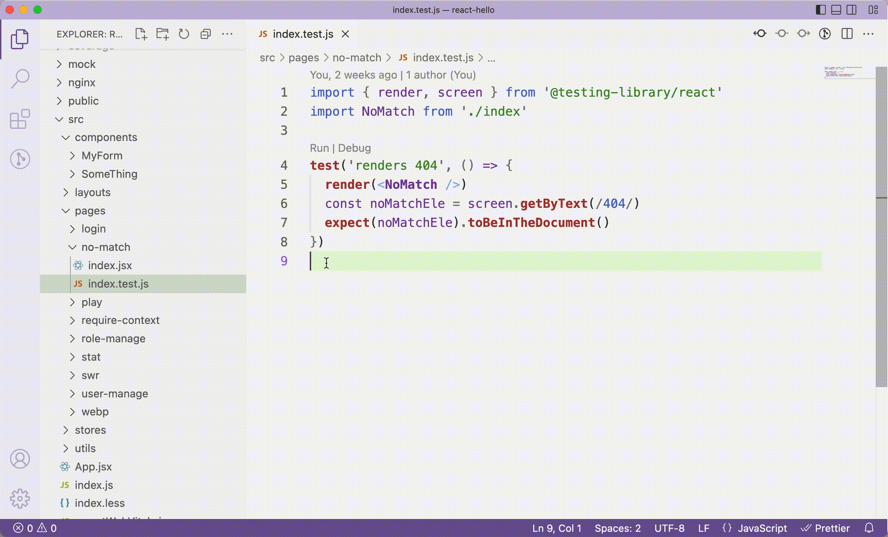

# jestcoverageofcurrentfile

`jestcoverageofcurrentfile` is a VS Code extension to easily get Jest coverage info for current test file.

1. focus on the test file, for example, `src/pages/no-match/index.test.js`
2. press `cmd + k` first (in windows is `ctrl + k`), and then press `j`
3. it will open a terminal and run `npm test -- "src/pages/no-match/index.test.js" "--watchAll=false" "--coverage" "--collectCoverageFrom=src/pages/no-match/index.js*"`

